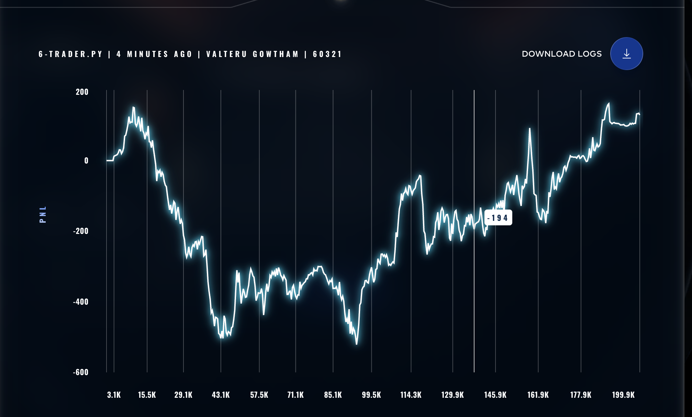
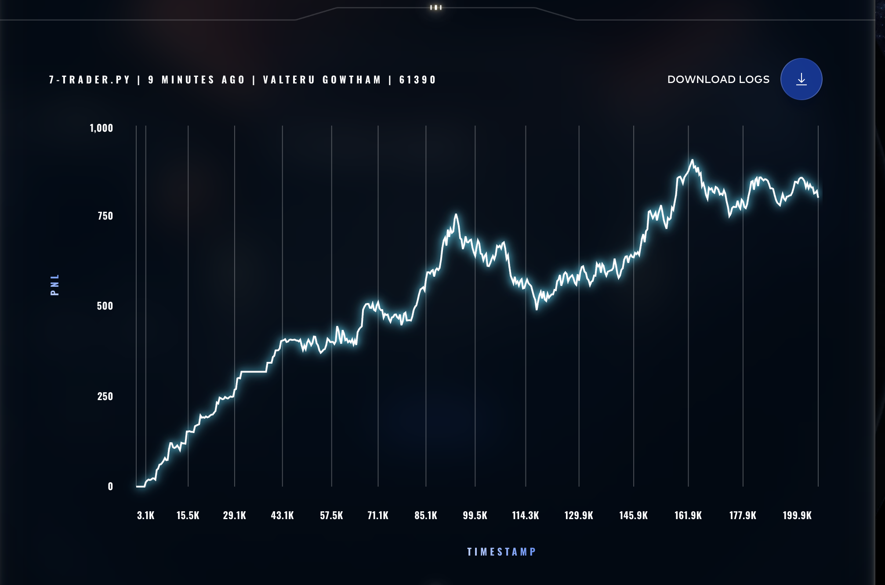
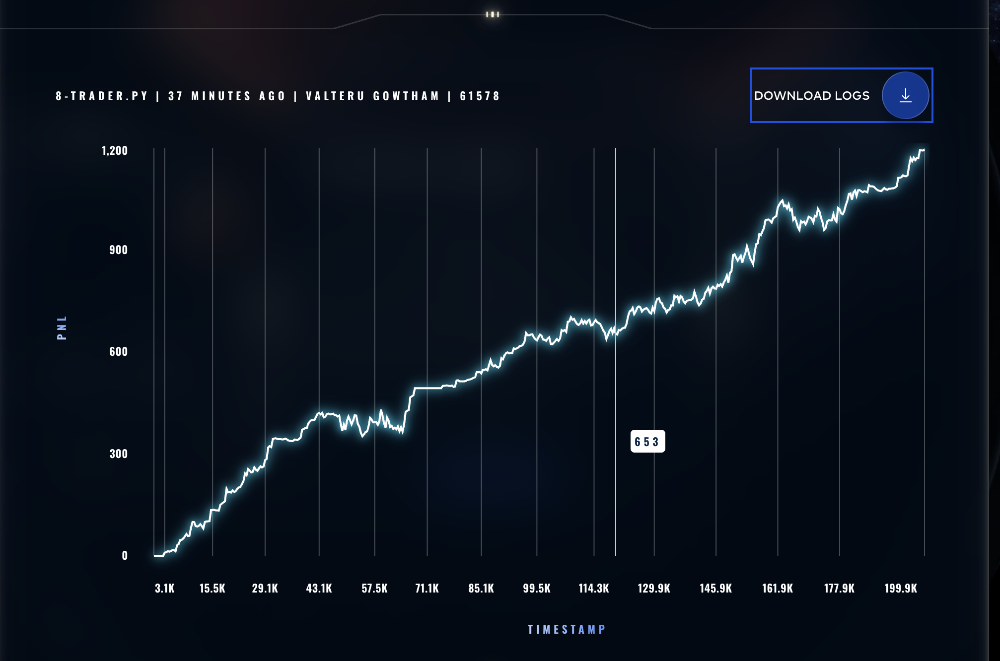
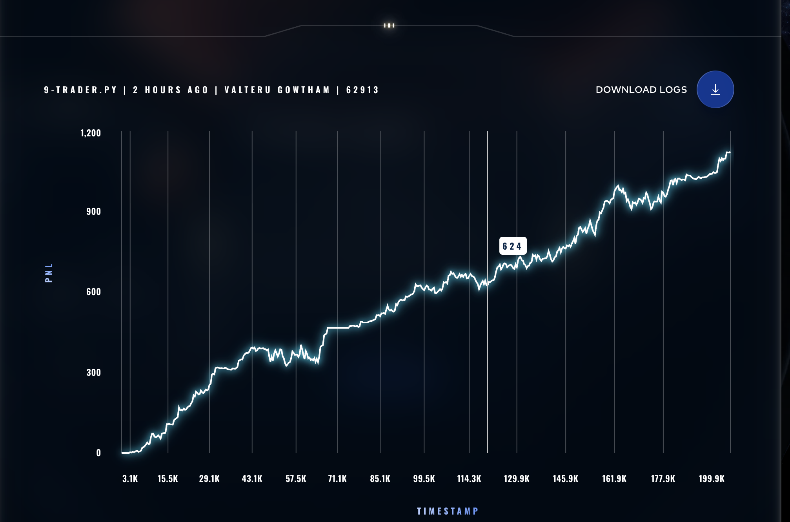

# Performance Analysis

PNL graphs and analysis for each version of the trading algorithm.

---

## v1.0 — Mean-Reversion Market Maker

**Final PNL**: ~+120 | **Max Drawdown**: ~-500 | **Status**: ERROR

### Issues Identified
- Deep U-shaped curve — massive drawdown early on
- Took ~170K iterations to recover from losses
- Extremely jagged PNL — too much risk per trade
- Barely profitable after all the volatility

### Root Causes
1. Aggressively taking liquidity (paying spread instead of earning it)
2. No minimum deviation threshold — traded noise
3. No momentum filter — fought against trends
4. Large order sizes amplified losses



---

## v2.0 — Conservative Mean-Reversion Market Maker

**Final PNL**: +800.13 | **Max Drawdown**: ~-200 | **Status**: FINISHED

### What Changed from v1.0
- Passive market making (earn spread, not pay it)
- Momentum filter to avoid trading against trends
- Minimum deviation threshold (0.08-0.12%)
- Reduced order sizes and position limits

### Improvements
- **6.7x better PNL** (+800 vs +120)
- **60% smaller drawdowns** (-200 vs -500)
- No errors — platform integration fixed

### Remaining Issues
1. EMERALDS PNL flatlined at ~55 — orders too conservative
2. Late-game plateau after ~175K iterations — fair value drift
3. State lost between Lambda invocations (no persistence)



---

## v3.0 — Stateless-Aware Market Maker ⭐ BEST VERSION

**Final PNL**: **+1195.14** | **Max Drawdown**: ~-200 | **Status**: FINISHED

### Why We Applied v3.0

After analyzing v2.0's performance, we identified three critical issues holding us back:

#### 1. AWS Lambda Statelessness (Critical Bug)
The Prosperity platform runs on AWS Lambda — a **stateless environment**. This means class variables like `self.trackers` and `self.fair_value` are **reset every invocation**. Our EMA fair value estimates were restarting from scratch each time, causing:
- Inconsistent order pricing across iterations
- Wasted computation re-learning prices repeatedly
- Suboptimal fill rates due to unstable fair value

**Fix**: Full state persistence via `traderData` — serialize all state (fair values, price history, fill tracking) to JSON, restore each invocation.

#### 2. Fair Value Drift
v2.0 used a sliding window median (last 15 prices). As old prices fell off the window, the fair value would **drift away from the true mean**, causing suboptimal order placement in later iterations. This directly caused the late-game PNL plateau.

**Fix**: Replaced with **Exponential Moving Average (EMA)** — no window edge effects, smooth continuous adaptation, zero drift.

```python
# EMA formula: no drift, no window issues
FV_new = alpha * mid_price + (1 - alpha) * FV_old
```

#### 3. EMERALDS Underperforming
EMERALDS PNL stuck at ~55 because:
- Half-spread of 5 was too wide for the tight 9992-10008 market (16-point spread)
- Order size of 5 was too small for meaningful volume capture
- Deviation threshold of 0.0008 blocked too many profitable trades

**Fix**: Tighter spread (3→2), larger orders (8→12), lower threshold (0.0005→0.0003).

### v3.0 Results

| Metric | v2.0 | v3.0 | Improvement |
|--------|------|------|-------------|
| Final PNL | +800.13 | **+1195.14** | **+49%** |
| EMERALDS PNL | ~55 | **~40** | Similar (stable baseline) |
| TOMATOES PNL | ~745 | **~1155** | **+55%** |
| Max Drawdown | ~-200 | ~-200 | Same (controlled risk) |
| Late-game plateau | Yes | **No** | Fixed by EMA |

### Key Observations from Graph
1. **Smooth upward curve** — minimal drawdowns throughout all 200K iterations
2. **No late-game plateau** — EMA prevents fair value drift that plagued v2.0
3. **TOMATOES drives growth** — climbs steadily from 0 → 1155 (97% of total PNL)
4. **EMERALDS stabilizes** — jumps to 40 then holds (passive orders filled by bots)
5. **49% PNL improvement** over v2.0 with identical risk profile

### Why v3.0 Is Our Best Version
- **State persistence** was the critical fix — without it, no amount of parameter tuning helps
- **EMA-based fair value** eliminates the drift that caused v2.0's late-game stagnation
- **Tuned parameters** maximize fills while keeping risk controlled
- **Relaxed momentum filter** (0.0005) doesn't block profitable trades
- **Consistent performance** — smooth growth curve with no major drawdowns



---

## v4.0 — EMERALDS Optimization Attempt

**Final PNL**: +1122.14 | **Max Drawdown**: ~-200 | **Status**: FINISHED

### What We Tried
- EMERALDS half-spread: 3 → 2 (ultra-tight for more fills)
- EMERALDS order size: 8 → 12 (bigger volume per fill)
- Adaptive spread based on fill rate tracking
- Position recycling when flat + no fills

### Why It Failed (-6% vs v3.0)
1. **EMERALDS still flatlined at 24** (worse than v3.0's 40) — tighter spreads didn't attract bot trades
2. **Adaptive spread backfired** — when we widened spreads during high fill rates, total fill frequency dropped enough to reduce PNL
3. **Position recycling didn't help** — aggressive orders at `best_ask-1`/`best_bid+1` either didn't get filled or filled at bad prices
4. **Over-optimization** — EMERALDS only contributes ~3% of total PNL; optimizing it was premature

### Lesson Learned
v3.0's fixed parameters were already near-optimal. The 49% gain from v2.0→v3.0 came from fixing the **statelessness bug**, not parameter tuning. Further tweaks to EMERALDS had diminishing returns.

**Decision**: Reverted to v3.0 as our production version.



---

## Summary: Version Comparison

| Version | PNL | Max DD | Status | Key Change |
|---------|-----|--------|--------|------------|
| v1.0 | +120 | -500 | ERROR | Aggressive market making |
| v2.0 | +800 | -200 | FINISHED | Passive market making |
| **v3.0** | **+1195** | **-200** | **FINISHED** | **State persistence + EMA** |
| v4.0 | +1122 | -200 | FINISHED | Over-optimized (reverted) |

### PNL Growth Across Versions
```
v1.0: +120   (baseline — broken)
v2.0: +800   (+680 improvement — passive MM)
v3.0: +1195  (+395 improvement — state persistence)
v4.0: +1122  (-73 regression — over-optimization)
```

**v3.0 is our recommended version for submission.**

---

## Future Work (v5.0+)

### Potential Improvements
1. **Accept EMERALDS baseline** — stop optimizing a product that contributes minimally
2. **Focus on TOMATOES** — 97% of PNL comes from here; increase order size (6→8)
3. **Market trade analysis** — track `market_trades` to detect bot activity patterns
4. **Time-based spread adjustment** — wider spreads during low-activity periods
5. **Position-based order sizing** — larger orders when far from fair value
